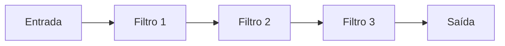
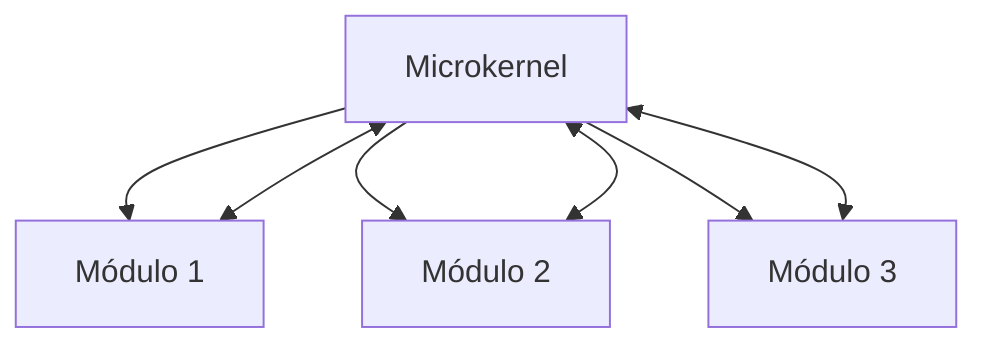

# das-1-2025-2-a
* [Aula 04/08](#aula-0408)
* [Aula 05/08](#aula-0508)
* [Aula 11/08](#aula-1108)
* [Aula 12/08](#aula-1208)
* [Aula 25/08](#aula-2508)
* [Aula 26/08](#aula-2608)
* [Aula 01/09](#aula-0109)
* [Aula 02/09](#aula-0209)
* [Aula 08/09](#aula-0809)
* [Aula 29/09](#aula-2909)
* [Aula 30/08](#aula-3009)
* [Aula 06/10](#aula-0610)
* [Aula 07/10](#aula-0710)
* [Aula 13/10](#aula-1310)
* [Aula 14/10](#aula-1410)
* [Aula 20/10 e 21/10](#aula-2010-e-2110)
* [Aula 27/10 e 28/10](#aula-2710-e-2810)
* [Aula 03/11 e 04/11](#aula-0311-e-0411)


## Aula 04/08
O que que é abstração
>Entender ou resolver um problema, simplificando a realidade ao nosso redor, focando no essencial

Código coeso
>Ele faz um trabalho, porém faz ele bem feito. Harmonia entre elementos.

vazada contínua -> herança
<br>
pontilhada -> implementação
<br>
preenchida contínua -> associação

---

## Aula 05/08
### SOLID
Usar a orientação de objetos de maneira correta

*Single Responsibility Principle*
>Aplicação direta da ideia de coesão. Uma classe deve ter apenas uma única responsabilidade e um único motivo para mudar.
* _Isso facilita a manutenção e evita que uma alteração afete outras funcionalidades._

*Open/Closed Principle*
>O código deve estar aberto para extensão, mas fechado para modificação.
* _Você pode adicionar novas funcionalidades sem alterar o código já existente, evitando erros em sistemas estáveis._

*Liskov Substitution Principle*
>Subclasses devem poder ser usadas no lugar da superclasse sem alterar o funcionamento do sistema.
* _Ou seja, heranças devem manter o comportamento esperado, sem quebrar regras da classe pai._

*Interface Segregation Principle*
>É melhor ter muitas interfaces específicas do que uma única interface genérica com muitos métodos.
* _Assim, classes implementam apenas o que realmente usam, mantendo o código mais limpo._

*Dependency Inversion Principle*
>Dependa de abstrações (interfaces) e não de classes concretas.
* _Isso torna o sistema mais flexível, facilitando testes e mudanças sem afetar o restante do código._

### MVC

#### Model
>Representa os dados e regras de negócio. É onde ficam as informações e lógica.
#### View
>Exibe a interface visual para o usuário. É responsável pela apresentação.
#### Controller
>Faz a ponte entre Model e View. Recebe comandos (ações do usuário), processa e atualiza a View e o Model.

## Code Single Responsibility Principle

~~~
package br.univille;

import javax.swing.JButton;
import javax.swing.JFrame;
import javax.swing.JOptionPane;

import java.awt.event.ActionEvent;
import java.awt.event.ActionListener;


public class Janelinha extends JFrame{

    private JButton botaozinho;
    private Controlador controlador;

    public Janelinha() {
        setTitle("Eu nao acredito");
        setSize(500,500);
        setDefaultCloseOperation(JFrame.EXIT_ON_CLOSE);

        botaozinho = new JButton("ME CLICA");
        controlador = new Controlador();
        botaozinho.addActionListener(controlador);
        
        add(botaozinho);

        setVisible(true);
    }
    public static void main(String[] args) {
        new Janelinha();
    }
}
Code Interface Segregation Principle
package br.univille;

import java.awt.event.ActionEvent;
import java.awt.event.ActionListener;

import javax.swing.JOptionPane;

public class Controlador implements ActionListener{

    @Override
    public void actionPerformed(ActionEvent e) {
        meClica();
    }

    private void meClica(){
        JOptionPane.showMessageDialog(null, "NAO ACREDITO");
    }
    
    
}
~~~

---

## Aula 11/08
### O que é o principio da inversão de dependencia?
* Ambas as classes devem depender de abstrações que definem o comportamento desejado. Com isso pode-se alterar outras classes sem ter alteração nas demais, desde que a interface permaneça a mesma.

### Herança
* Que uma classe utilize caracteristicas de uma classe pai.

### Demeter
* Tenta evitar variáveis globais para que possa ser utilizado variáveis locais. Visando reduzir o acoplamento entre classes e promover o encapsulamento.

---

## Aula 12/08
### Liskov
* Para manter a herança e a compatibilidade com o pai, codificar o código dos filhos desde que não afete o resto. as subclasses devem se comportar de maneira compatível com a superclasse, permitindo que sejam usadas em qualquer contexto onde a superclasse seja esperada.
  
---

## Aula 25/08
### Observer
* É um jeito de um objeto avisar automaticamente outros objetos quando algo muda nele.
1. O publisher mantém uma lista de observers que se inscrevem.
2. Quando o estado do publisher muda, ele notifica todos os observers inscritos.
3. Os observers tem um método que é chamado para reagir à mudança.
4. Isso permite que vários objetos fiquem sincronizados sem ficarem muito acoplados.

---

## Aula 26/08
#### Cararcteristicas de arquiteturas
* As características de arquitetura são os atributos de qualidade de um sistema, como sua performance, segurança e escalabilidade. Elas definem o "quão bem" o sistema faz o que deve fazer, impactando diretamente a experiência do usuário e a manutenção do software.

#### Decisões arquiteturais
* As decisões arquiteturais são as escolhas mais importantes e difíceis de reverter no design de um sistema. Elas incluem a escolha do estilo de arquitetura (como microsserviços ou monolito), a seleção de tecnologias e a forma como os componentes se comunicam. Essas decisões moldam a estrutura e as características de um sistema.

#### Princípios do design
* Os princípios de design são diretrizes que ajudam a equipe a escrever um código de melhor qualidade, mais limpo e fácil de manter. Eles se aplicam a um nível mais detalhado e guiam a criação de componentes, como as classes. Um exemplo famoso é o SOLID, um conjunto de cinco princípios que promovem um código mais flexível e sustentável.

---

## Aula 01/09
#### Caracteristicas de arquitetura
1. Não Funcionais
2. Funcionais

#### Decisão Arquiterual
* Escolhe em que arquitetura irá utilizar, decide qual será suas caracteristircas.

1. Tomar decisões de arquiteturas
2. Analisar continuamente a arquitetura
3. Manter-se atualiado com as ultimas tendencias
4. Assegurar a conformidade com as decisoes

_um arquiteto deve orientear quais tecnologias utilizar, baseando-se no seu conhecimento e sabendo quais as melhores para o desenvolvimento do projeto. Levando em consideração desempenho, escalabilidade ou disponibilidade._

* É o papel do arquitero assegurar que seja desenvolvido utilizando os seus princípios documentados e comunicados por ele.

#### DevOps
>Maneira de entregar valor ao meu cliente mais rápido.

[Introdução a DevOps](https://learn.microsoft.com/pt-br/training/modules/introduction-to-devops/2-what-is-devops?ns-enrollment-type=learningpath&ns-enrollment-id=learn.wwl.az-400-work-git-for-enterprise-devops)

---

## Aula 02/09

### Diferença entre Arquitetura e Design

#### Arquitetura
1. Refere-se às decisões mais importantes e de longo prazo sobre o sistema.
2. São as escolhas que têm maior impacto em qualidade, manutenibilidade, escalabilidade, segurança e desempenho.
3. Normalmente envolvem restrições que são difíceis ou custosas de mudar depois.
4. Exemplos:
    * Escolher se o sistema será monolítico, em microsserviços ou em camadas.
    * Definir protocolos de comunicação (REST, gRPC, mensageria).
    * Decidir como dados serão persistidos (SQL, NoSQL, event sourcing).
  
#### Design
1. Refere-se às decisões mais locais, de baixo nível, que podem ser mudadas com mais facilidade.
2. São importantes, mas geralmente não têm impacto estrutural em todo o sistema.
3. Envolvem a organização interna de classes, métodos, módulos e padrões de implementação.
4. Exemplos:
    * Usar um padrão de projeto (Factory, Strategy, Singleton).
    * Estruturar os métodos de uma classe.
    * Nomear variáveis e organizar pacotes.
### Como é a formação do conhecimento de um arquiteto modelo T?

#### Produndidade (barra vertical T)
* O arquiteto deve ter profundidade técnica real em uma ou mais áreas específicas.

* Essa profundidade geralmente vem da experiência prática como desenvolvedor, lidando com detalhes de implementação, padrões de projeto, linguagens e frameworks.

* Exemplos: domínio profundo em bancos de dados relacionais, microsserviços, segurança de aplicações, ou computação em nuvem.

* Essa base técnica sólida dá ao arquiteto credibilidade junto aos desenvolvedores e permite avaliar impactos de decisões.

#### Conhecimento Amplo (barra horizontal T)

* Além da profundidade, o arquiteto precisa ter amplitude de conhecimento sobre muitas disciplinas que afetam a arquitetura:

    * Diferentes estilos arquiteturais (monólito, SOA, microsserviços, orientada a eventos etc.).
    * Processos de desenvolvimento (integração contínua, entrega contínua, testes automatizados).
    * Práticas de infraestrutura (DevOps, containers, observabilidade, escalabilidade).
    * Entendimento de domínio de negócio e das necessidades organizacionais.
    * Habilidades interpessoais: comunicação, negociação, facilitação e liderança técnica.

* Essa amplitude ajuda o arquiteto a transitar entre diferentes áreas e conversar com públicos diversos (devs, gestores, stakeholders de negócio).

#### Síntese do modelo T

* O arquiteto modelo T não é só um especialista profundo nem apenas um generalista superficial.

* Ele combina profundidade em pontos específicos (garantindo que entende os detalhes técnicos) com uma base ampla (que dá visão estratégica e capacidade de integração).

* O livro reforça que esse equilíbrio é essencial, porque arquitetura de software envolve trade-offs: só com profundidade + amplitude o arquiteto consegue tomar decisões conscientes.

---

# Aula 08/09

* Um tópico atua como um intermediário de comunicação assíncrona entre quem produz e quem consome eventos. Quem dá o lance envia a informação para o tópico, que funciona como um canal centralizado. Esse tópico então distribui o mesmo evento para diferentes consumidores, como os serviços de capturar, rastrear e analisar lance. Dessa forma, o produtor não precisa conhecer diretamente os consumidores, e cada consumidor pode processar o evento de forma independente. Isso garante desacoplamento, flexibilidade e a possibilidade de vários serviços reagirem ao mesmo evento ao mesmo tempo.

* Na abordagem com filas, o produtor envia mensagens diretamente para cada fila destinada a um consumidor específico. Isso significa que, quem dá o lance precisa enviar o mesmo item três vezes: uma vez para a fila de captura, outra para a fila de rastreamento e outra para a fila de análise. Cada fila é consumida por apenas um serviço, que recebe sua própria cópia da mensagem. O modelo garante isolamento no processamento, mas aumenta o acoplamento, já que o produtor precisa conhecer todos os consumidores e enviar a mensagem individualmente para cada um deles.

* Um trade-off é como uma troca. Quando você escolhe uma solução em arquitetura de software, você ganha algo, mas também perde em outro aspecto. Não existe decisão sem consequência — cada escolha tem um preço.

Por exemplo:

1. Se você escolhe microsserviços, ganha escalabilidade e independência de equipes, mas perde em simplicidade, porque a arquitetura fica mais difícil de gerenciar.

2. Se escolhe um monólito, ganha em facilidade de desenvolvimento e implantação, mas perde em flexibilidade e escalabilidade.
O arquiteto precisa sempre pesar essas trocas e decidir o que é mais importante para aquele sistema e naquele momento.

**trade-off é o equilíbrio entre ganhos e perdas ao tomar uma decisão arquitetural.**

---

# Aula 29/09

### Circuit Braker

- Os estados do circuit breaker são:
1. Fechado: Todas as solicitações são enviadas diretamente para o serviço externo, e o circuit breaker monitora continuamente as solicitações e respostas. 
2. Aberto: O circuit breaker interrompe a comunicação com o serviço assim que uma falha é detectada. 
3. Semi-aberto: Permite que algumas solicitações sejam enviadas ao serviço para verificar se ele está funcionando novamente. 
Esses estados ajudam a gerenciar a comunicação com serviços externos e a evitar falhas em cascata.

---

# Aula 30/09
- Implementação Filas: Producer / Consumer

---

# Aula 06/10

### Definições das Características Arquiteturais

#### O que são
- Requisitos além da funcionalidade do domínio.
- Devem:
1. Considerar design fora do domínio.
2. Influenciar a estrutura do sistema.
3. Ser essenciais ao sucesso.
- Podem ser explícitas (nos requisitos) ou implícitas (não escritas, mas necessárias).
  
#### Categorias principais
- Operacionais: desempenho, escalabilidade, disponibilidade, confiabilidade, recuperabilidade, robustez.
- Estruturais: modularidade, reutilização, manutenção, portabilidade, atualização.
- Transversais: segurança (autenticação, autorização, privacidade), acessibilidade, usabilidade, requisitos legais.
  
#### Aspectos chave
- Não existe lista universal (cada empresa define as suas).
- Muitas características se sobrepõem (ex.: confiabilidade x disponibilidade).
- ISO traz categorias como: desempenho, compatibilidade, usabilidade, confiabilidade, segurança, manutenibilidade, portabilidade.

#### Trade-offs
- Melhorar uma característica pode prejudicar outra (ex.: segurança vs. desempenho).
- Arquitetura deve equilibrar prioridades.

#### Lições principais
- Escolher poucas características essenciais.
- Projetar arquitetura iterativa e adaptável.
- Buscar a “menos pior”, não a perfeita.

---

# Aula 07/10
### CQRS

#### O que é
- Padrão de arquitetura que separa escrita (commands) de leitura (queries) com modelos de dados distintos.

#### Problemas que resolve

- Dificuldade em otimizar leitura e escrita no mesmo modelo.
- Contenção de bloqueios em banco de dados.
- Consultas complexas e lentas.
- Mistura de regras de segurança para leitura e escrita.

#### Como funciona

- Commands: alteram o estado do sistema (operações de escrita).
- Queries: retornam dados sem modificar o estado (operações de leitura).
- Modelos de leitura e escrita podem estar no mesmo ou em bancos diferentes.

#### Benefícios

- Escalabilidade separada para leitura e escrita.
- Modelos de dados otimizados para cada propósito.
- Melhor controle de segurança.
- Código mais organizado e responsabilidades bem definidas.

#### Desvantagens

- Maior complexidade de implementação.
- Consistência eventual (leituras podem estar desatualizadas).
- Necessidade de sincronizar os modelos de leitura e escrita.
- Sobrecarga ao manter visões ou materializações.

#### Quando usar

- Sistemas com muitas leituras e escritas concorrentes.
- Aplicações baseadas em tarefas ou processos.
- Necessidade de otimização distinta para leitura e escrita.
- Projetos em evolução ou que precisam integrar subsistemas diferentes.

---

# Aula 13/10

#### Retry Pattern

- O Retry Pattern, segundo a Microsoft, é um padrão de resiliência usado para lidar com falhas temporárias em sistemas distribuídos. Ele faz com que uma operação que falhou seja tentada novamente após um intervalo de tempo, em vez de falhar de imediato.
- Normalmente usa estratégias como exponential backoff (aumentar o tempo entre tentativas) e limite máximo de tentativas. É útil para falhas transitórias de rede, APIs ou bancos de dados, e pode ser implementado com ferramentas como Polly no .NET.

#### Fundamentos dos padrões culturais (Fundamentos)

- Os padrões fundamentais de arquitetura ajudam a organizar o código e definir a estrutura dos sistemas. Um exemplo clássico é o padrão em camadas, que separa responsabilidades conforme a funcionalidade.

- O antipadrão Grande Bola de Lama representa sistemas sem estrutura, com código confuso e difícil de manter, geralmente causados por falta de governança técnica.

- A arquitetura unitária foi o modelo inicial dos sistemas, evoluindo para cliente/servidor e três camadas, que separam a aplicação entre interface, lógica de negócio e banco de dados, melhorando a escalabilidade e manutenção.

- Esses padrões influenciaram até o design de linguagens como o Java e mostram que decisões arquiteturais impactam o longo prazo, reforçando a importância de manter simplicidade e boa estrutura no projeto.

---

# Aula 14/10

As arquiteturas monolíticas concentram todo o código em uma única unidade, enquanto as arquiteturas distribuídas dividem o sistema em várias partes que se comunicam por rede. Embora as distribuídas ofereçam maior desempenho, escalabilidade e disponibilidade, trazem novos desafios e trade-offs.

Esses desafios são resumidos nas oito falácias da computação distribuída, que incluem suposições incorretas como:

1. A rede é confiável — falhas de conexão sempre podem ocorrer.

2. A latência é zero — a comunicação remota é muito mais lenta que a local.

3. A largura de banda é infinita — transferências excessivas entre serviços afetam o desempenho.

4. A rede é segura — cada endpoint precisa ser protegido.

5. A topologia nunca muda — alterações na rede afetam o sistema.

6. Existe apenas um administrador — há muitos responsáveis pela infraestrutura.

7. O custo do transporte é zero — chamadas remotas exigem mais recursos e dinheiro.

8. A rede é homogênea — diferentes equipamentos e provedores nem sempre funcionam bem juntos.

Além disso, sistemas distribuídos enfrentam dificuldades com logs e transações, exigindo ferramentas específicas para consolidação de logs e uso de transações distribuídas com consistência eventual (como o padrão BASE e sagas transacionais).

---

# Aula 20/10 e 21/10

#### Arquitetura em Camadas
A arquitetura em camadas (ou n-tier) é um dos estilos mais populares, principalmente pela sua simplicidade e boa organização. Ela consiste em dividir o sistema em diferentes camadas, cada uma com uma função específica e bem definida.

#### Estrutura Geral
As camadas são dispostas horizontalmente, seguindo uma hierarquia funcional, geralmente assim:
* __Camada de Apresentação__ → Responsável pela interface com o usuário
* __Camada de Negócios__ → Onde ficam as regras e lógicas da aplicação
* __Camada de Persistência__ → Gerencia o acesso e manipulação dos dados
* __Banco de Dados__ → Responsável pelo armazenamento das informações
Cada camada se comunica apenas com a camada imediatamente abaixo, promovendo uma estrutura modular e mais fácil de manter.

#### Camadas Abertas vs. Fechadas
* __Camadas Fechadas:__ o fluxo deve respeitar a ordem entre camadas, sem pular etapas.
* __Camadas Abertas:__ permitem acesso direto entre camadas, o que traz mais flexibilidade, mas também pode aumentar o acoplamento.

#### Principais Vantagens
* Fácil de entender e implementar
* Custo de desenvolvimento mais baixo
* Facilita a manutenção e a divisão clara de responsabilidades

#### Possíveis Desvantagens
* Pode ser difícil de escalar ou testar em sistemas muito grandes
* Menor agilidade para mudanças rápidas
* Risco de acoplamento excessivo se mal projetada

#### Quando é uma Boa Escolha?
É uma ótima opção para sistemas pequenos ou médios, ou ainda como estrutura inicial quando a arquitetura do projeto ainda não está totalmente definida.
<<<<<<< HEAD
=======

---

# Aula 27/10 e 28/10

#### Estilo de Arquitetura: Pipeline (Pipe and Filter)

O **estilo de arquitetura Pipeline** — também conhecido como **Pipe and Filter** — organiza o sistema como uma sequência de **filtros** (componentes independentes) conectados por **pipes** (canais).  
Cada filtro transforma os dados que recebe e envia o resultado para o próximo filtro no fluxo.

#### Estrutura

- **Filtros:** realizam transformações nos dados (ex: análise, cálculo, formatação).  
- **Pipes:** canais responsáveis por transportar a saída de um filtro para o próximo.

#### Funcionamento

1. O primeiro filtro recebe os dados de entrada.  
2. Cada filtro processa a informação e envia o resultado para o próximo.  
3. O último filtro produz a saída final do sistema.  

Exemplo:

Entrada → [Filtro 1] → [Filtro 2] → [Filtro 3] → Saída

#### Exemplo de Uso

Um **compilador** pode ser estruturado como um pipeline:

Código-fonte → Analisador Léxico → Analisador Sintático → Otimizador → Gerador de Código → Executável

#### Vantagens

- Alta **modularidade** e **reutilização** dos filtros.  
- **Fácil manutenção** (cada filtro é independente).  
- Possibilidade de **execução paralela** e **processamento contínuo (streaming)**.

#### Desvantagens

- Pode haver **sobrecarga** na comunicação entre filtros.  
- Requer **formato de dados compatível** entre as etapas.  
- **Difícil de aplicar** em sistemas com dependências complexas entre componentes.

#### Aplicações Comuns

- Compiladores  
- Sistemas **ETL** (Extração, Transformação e Carga)  
- Processamento de **imagens**, **áudio** e **vídeo**  
- **Pipelines** de CI/CD e Machine Learning

#### Diagrama (Mermaid)


```mermaid
flowchart LR
    A[Entrada] --> B[Filtro 1]
    B --> C[Filtro 2]
    C --> D[Filtro 3]
    D --> E[Saída]
```
---

# Aula 03/11 e 04/11

#### Estilo de Arquitetura: Microkernel

O **estilo de arquitetura Microkernel** (ou **Núcleo Modular**) é um modelo em que o sistema é dividido em um **núcleo central mínimo** (microkernel) e um conjunto de **módulos plugáveis** que adicionam funcionalidades específicas.  
Essa abordagem é muito usada em **sistemas operacionais**, **ferramentas de servidor** e **aplicações extensíveis**.

#### Estrutura

- **Microkernel (Núcleo Central):** fornece os serviços básicos do sistema, como comunicação, gerenciamento de processos e recursos.  
- **Serviços Internos (Core Services):** executam funções essenciais diretamente ligadas ao núcleo.  
- **Serviços Externos ou Plug-ins:** módulos adicionais que estendem o sistema sem alterar o núcleo, podendo ser carregados ou descarregados dinamicamente.

#### Funcionamento

1. O **microkernel** gerencia a comunicação entre módulos e os recursos do sistema.  
2. Os **módulos (plug-ins)** registram-se no núcleo e interagem entre si por meio de mensagens.  
3. O sistema pode ser **expandido** adicionando novos módulos sem modificar o núcleo principal.

Exemplo de fluxo:
[Usuário] → [Módulo A] ↔ [Microkernel] ↔ [Módulo B] → [Serviço]

#### Exemplo de Uso

Um **sistema operacional moderno**, como o **MacOS** ou o **Windows NT**, utiliza uma arquitetura microkernel, onde:
- O **núcleo** controla processos, memória e comunicação.  
- Os **drivers**, **sistemas de arquivos** e **serviços de rede** funcionam como módulos separados.  

Outro exemplo comum são **IDE’s** (como Eclipse ou VS Code), que possuem um núcleo leve e permitem adicionar **extensões**.

#### Vantagens

- Alta **modularidade** e **flexibilidade**.  
- **Facilidade de manutenção** e atualização de módulos.  
- **Isolamento de falhas** — se um módulo falhar, o núcleo continua em execução.  
- **Escalabilidade** — novos recursos podem ser adicionados sem interromper o sistema.

#### Desvantagens

- **Complexidade** na comunicação entre o núcleo e os módulos.  
- Pode ocorrer **sobrecarga de desempenho** devido à troca de mensagens.  
- **Desenvolvimento inicial mais difícil**, pois o núcleo precisa ser altamente confiável e estável.

#### Aplicações Comuns

- **Sistemas operacionais** (ex: Minix, QNX, MacOS, Windows NT)  
- **Servidores modulares** e **middleware**  
- **Ambientes de desenvolvimento** (ex: Eclipse, VS Code)  
- **Softwares extensíveis e personalizáveis**

#### Diagrama (Mermaid)


```mermaid
flowchart TB
    A[Microkernel] --> B[Módulo 1]
    A --> C[Módulo 2]
    A --> D[Módulo 3]
    B <--> A
    C <--> A
    D <--> A
```
---

# Aula 10/11 e 11/11

### Arquitetura de Microsserviços

A **arquitetura de microsserviços** é um estilo de arquitetura **distribuído, desacoplado e centrado no domínio**, em que cada serviço é pequeno, independente e responsável por uma funcionalidade específica do sistema.  
Esse modelo permite **alta escalabilidade, resiliência e evolução contínua** das aplicações modernas.

### História

Popularizada por **Martin Fowler** e **James Lewis (2014)**, a arquitetura de microsserviços surgiu como resposta às limitações das arquiteturas **monolíticas** e **SOA (Service-Oriented Architecture)**.  
Inspirada nos princípios do **Domain-Driven Design (DDD)**, ela se baseia fortemente no conceito de **Contexto Delimitado** (*Bounded Context*).

### Conceitos Fundamentais

### 🧩 Desacoplamento e Contexto Delimitado
Cada serviço modela um domínio de negócio de forma **independente**, com seu próprio código e banco de dados.  
> Preferimos **duplicar** código a criar **acoplamento** entre serviços.

### Isolamento de Dados
Cada microsserviço possui seu **próprio repositório de dados**, evitando esquemas e integrações compartilhadas.

### Granularidade
Os serviços devem ter **tamanho funcional**, não necessariamente “micro”.  
A granularidade correta é a que **representa bem o domínio** e **evita dependências desnecessárias**.

### Topologia e Comunicação

- Arquitetura **distribuída**: cada serviço roda em seu próprio processo ou contêiner.  
- Comunicação:
  - **Síncrona** → REST, gRPC  
  - **Assíncrona** → eventos, filas e mensageria  
- **Coreografia** é preferida à **orquestração**, pois mantém a independência entre serviços.

### Transações e Sagas

Transações distribuídas são **evitadas** para preservar o desacoplamento.  
Quando necessárias, usa-se o **padrão Saga**, que coordena ações e desfaz (compensa) operações em caso de erro.

```mermaid
sequenceDiagram
  participant A as Serviço A
  participant B as Serviço B
  participant Mediator as Saga
  A->>Mediator: Inicia transação
  Mediator->>B: Executa operação
  alt Erro
    Mediator->>A: Compensar operação
  end
---